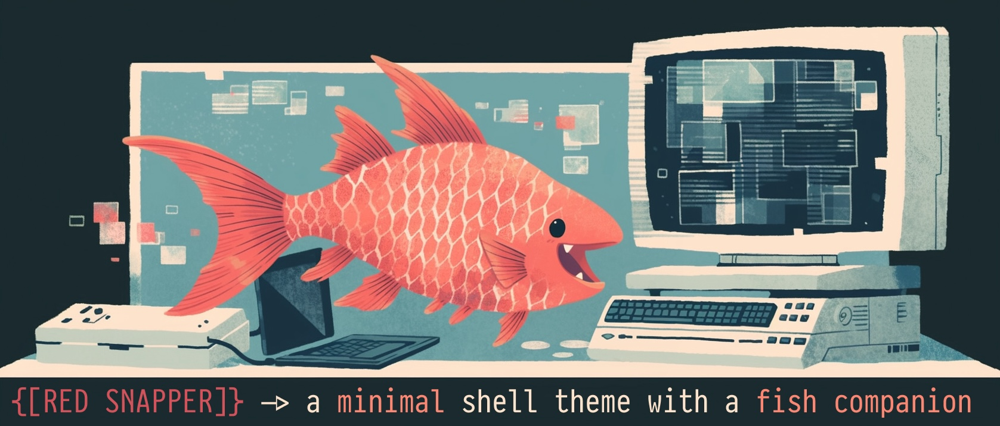
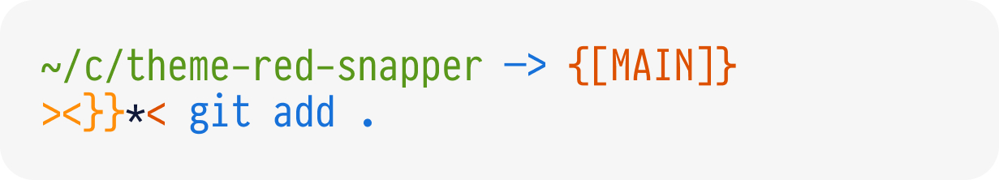
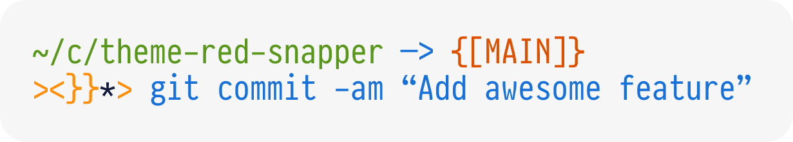
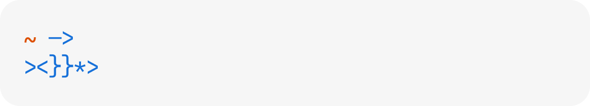

# RED SNAPPER

## Features
+ Directory path
+ Git branch name
+ Git status
+ A LOYAL FISH PET!

## Git Status
### Track changes
Your fish will identify if you've added files without tracking them. It will open its mouth, eager for new commits!

After you've committed, it will close its mouth, satisfied.

### Can't find .git
Something is fishy here! If you're not within a Git working directory, your pet will go to sleep.

